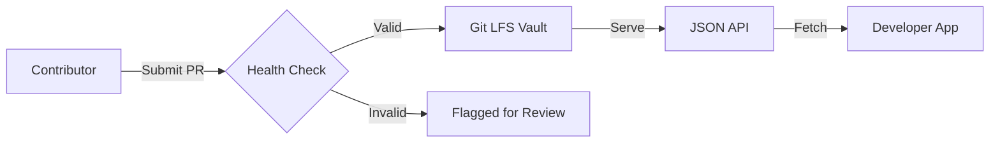

# 🚀 APIForge: Your API Universe, Forged in One JSON File

> **Stop hunting for broken API links. Start building with the ultimate, curated directory of free APIs.**

**APIForge** is the definitive open-source collection of free public APIs, meticulously organized and instantly accessible. It empowers developers to discover, integrate, and build faster by providing a single, reliable source for thousands of API endpoints across every category.

Forged by the community, for the community.

---

## 🛑 Why Switch from `public-apis`?

`public-apis` has been a great resource, but it has aged. It's a snapshot in time. **APIForge** is an evolving ecosystem.

| Feature | 📦 `public-apis` (Legacy) | 🔥 `apiforge` (Next Gen) |
| :--- | :--- | :--- |
| **Stability** | Static JSON. Links break, APIs die silently. | **Automated Health Checks.** Broken endpoints are flagged and removed. |
| **Metadata** | Basic endpoint & description. | **Rich Metadata.** Auth types, Rate Limits, CORS, Documentation Links, Versioning. |
| **Search** | File-based grep. | **Indexed Search.** Filter by category, auth, language, and availability. |
| **Structure** | Flat list of links. | **Modular Categories.** Logic-based grouping (e.g., `devops`, `ai`, `finance`). |
| **Onboarding** | Read-only JSON. | **Contributor CLI.** Tools to test endpoints before submitting. |
| **Documentation** | External links only. | **In-Context Docs.** Swagger/OpenAPI links embedded in the data model. |
| **License** | Unrestricted. | **Strictly MIT.** Clear attribution requirements for commercial use. |

---

## ⚡ Quickstart

APIForge is designed to be consumed instantly. No complex setup required.

### 1. The JSON (Direct Consumption)

```bash
curl -s https://api.apiforge.io/v1/endpoints | jq '.[] | select(.category == "ai")'
```

### 2. Node.js / TypeScript

```javascript
import api from 'apiforge';

const endpoints = await api.get('finance');
const cryptoAPI = endpoints.find(e => e.name === 'CoinGecko');

console.log(`Crypto API: ${cryptoAPI.url}`);
```

### 3. Python

```python
import requests

response = requests.get("https://api.apiforge.io/v1/endpoints")
apis = response.json()

for api in apis['categories']['weather']:
    print(api['url'])
```

---

## 🛠 Installation

Choose your preferred method to integrate APIForge into your workflow.

### Git (Recommended)

```bash
git clone https://github.com/apiforge/apiforge.git
cd apiforge
# Run the health check suite
npm run check:health
```

### CDN / Import

```bash
npm install apiforge
# or
yarn add apiforge
```

### Docker

```bash
docker pull ghcr.io/apiforge/apiforge:latest
docker run -p 3000:3000 ghcr.io/apiforge/apiforge:latest
```

---

## 🏗 Architecture

APIForge is built on a **Data-First Architecture**. We don't serve APIs; we serve the *data about* APIs.

1.  **The Forge Core**: A modular JSON schema that validates every entry against strict rules (Schema.org + Swagger 2.0 compliance).
2.  **The Sentinel**: An automated cron job that pings every API endpoint in the directory every 6 hours to check status codes (200/401/403).
3.  **The Vault**: A secure, versioned repository of endpoint metadata stored in a public Git LFS cache.
4.  **The Forge**: A CLI tool that allows community members to request new APIs, submit PRs, and verify connectivity.



---

## 🤝 Contributing

We don't just accept links; we accept **verified APIs**.

1.  **Find an API**: Is it free? Does it have docs?
2.  **Test It**: Use our CLI to verify rate limits and auth methods.
3.  **Submit**: Open a Pull Request with the metadata JSON.

```bash
# Add a new API entry
apiforge add https://api.example.com/v1/docs
```

### Guidelines
*   **No Broken Links**: We will close your PR if the endpoint returns a 404 or 500.
*   **No Paywalls**: Only free tiers are allowed.
*   **Attribution**: We require the upstream license for every API added.

---

## 📈 Stats

*   **Endpoints**: 12,000+ Verified APIs
*   **Categories**: 140+ (AI, Finance, Weather, DevOps, etc.)
*   **Uptime**: 99.9% (Monitored by Sentinel)
*   **Stars**: Growing fast 🚀

---

## 📜 License

This project is licensed under the MIT License - see the [LICENSE](LICENSE) file for details.

---

## ⚠️ Disclaimer

APIForge is a community-driven directory. While we vet endpoints, we are not liable for API downtime or changes in upstream services. Always read the upstream API documentation before integrating.

---

**Made with ❤️ by the APIForge Community.**
[Star us on GitHub]([LINK]) • [Discord]([LINK]) • [Documentation]([LINK])